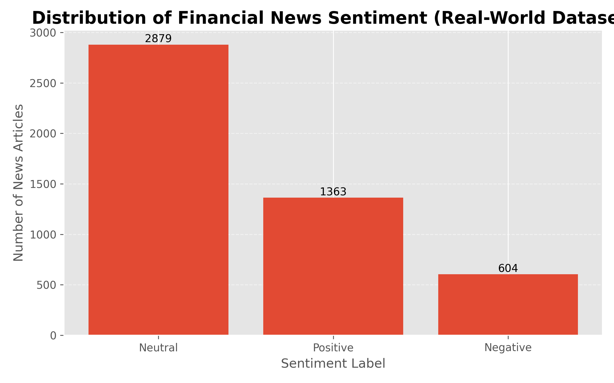

# Financial News Sentiment Analysis

An end-to-end Natural Language Processing (NLP) project that analyzes financial news sentiment and explores its relationship with stock market trends.

---

## 🚀 Project Highlights
- Built a complete NLP pipeline from raw text to insights
- Classified financial news into Positive, Negative, and Neutral sentiment
- Achieved ~72% model accuracy using Logistic Regression
- Integrated stock market data using yFinance
- Visualized sentiment vs market behavior

---

## 🧠 How It Works
1. Load financial news dataset
2. Clean and preprocess text data
3. Convert text into numerical features (TF-IDF)
4. Train machine learning model (Logistic Regression)
5. Evaluate model performance
6. Generate sentiment predictions
7. Analyze relationship with market trends
8. Visualize insights

---

## 📊 Visualizations

### Sentiment Distribution

### Sentiment vs Market Returns

### Market Trend

---

## 📁 Project Structure
financial-news-sentiment-analysis/
├── data/
├── notebooks/
├── outputs/
├── src/
├── README.md
└── requirements.txt

---

## ⚙️ How to Run
git clone https://github.com/Charvita-vali/financial-news-sentiment-analysis  
cd financial-news-sentiment-analysis  
pip install -r requirements.txt  
python src/main.py  

---

## 📦 Dataset
- Sample dataset included in `data/`
- Real dataset sourced from Kaggle financial news datasets
- Contains labeled financial news headlines for sentiment classification

---

## ⚠️ Limitations
- Dataset partially synthetic / limited
- Market correlation is illustrative, not predictive
- Model can be improved with advanced NLP techniques

---

## 🔮 Future Improvements
- Implement deep learning models (LSTM, BERT)
- Add real-time news data pipeline
- Build interactive dashboard (Streamlit)
- Improve feature engineering

---

## 👤 Author
Charvita Vali