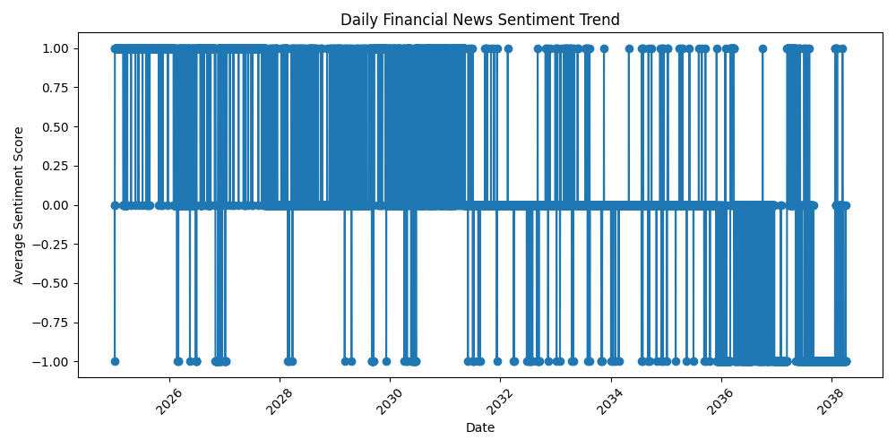
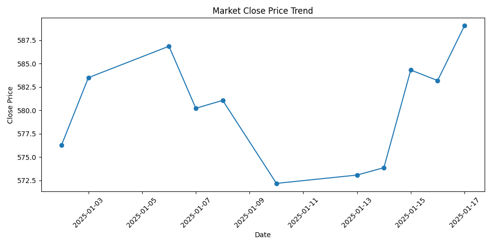
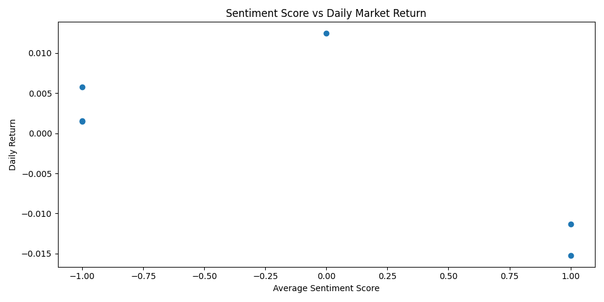

# Financial News Sentiment Analysis & Market Insights

An end-to-end NLP project that classifies financial news sentiment and analyzes its relationship with market behavior.

## Project Overview
This project:
- Collects or ingests financial news headlines/articles
- Cleans and preprocesses text data
- Classifies sentiment as Positive, Negative, or Neutral
- Aggregates sentiment trends over time
- Joins sentiment outputs with market data
- Generates insights for financial and news-based decision-making

## Business Problem
Financial markets often react quickly to news sentiment. This project helps analysts understand whether sentiment trends in financial news align with market movement and can support research, reporting, and decision-making.

## Tech Stack
- Python
- Pandas, NumPy
- scikit-learn
- NLTK
- Matplotlib
- yfinance

## Repository Structure
```text
financial-news-sentiment-analysis/
├── README.md
├── requirements.txt
├── .gitignore
├── data/
│   └── sample_financial_news.csv
├── notebooks/
│   └── financial_news_sentiment_analysis.ipynb
└── src/
    ├── data_preprocessing.py
    ├── sentiment_model.py
    ├── market_analysis.py
    └── main.py
```

## How It Works
1. Load financial news data
2. Clean and preprocess text
3. Train a sentiment classification model
4. Predict sentiment on unseen headlines
5. Aggregate daily sentiment scores
6. Compare sentiment trend with market returns

## Sample Use Cases
- Market intelligence
- Financial reporting support
- News trend monitoring
- Investor sentiment research

## Setup
```bash
pip install -r requirements.txt
python src/main.py
```

## Example Resume Bullet
- Built an NLP-based sentiment analysis model to classify financial news and analyzed sentiment trends against market behavior to generate data-driven financial insights.

## Interview Explanation
“I built an end-to-end NLP project that classifies financial news sentiment into positive, negative, and neutral categories. Then I aggregated sentiment over time and compared it with market movement to identify relationships between media tone and financial performance. The project helped demonstrate how unstructured text data can be transformed into meaningful business insights.”

## Next Improvements
- Fine-tune a transformer model such as FinBERT
- Add dashboard visualizations in Power BI or Streamlit
- Deploy as an API for real-time sentiment scoring

## 📊 Output Visualizations




